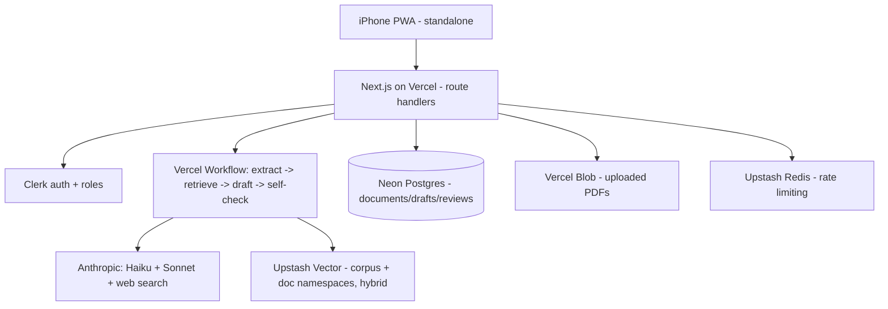

# PayGuard

PayGuard helps a small compliance/fintech team turn financial documents into
**trustworthy, citation-grounded compliance language that a human signs off on** —
fast, on a phone. Upload a PDF or paste text; PayGuard extracts the obligations,
retrieves supporting context from a shared regulatory corpus _and_ the document
itself, drafts compliance language with inline citations, runs an automated
faithfulness self-check, and routes the draft to a human reviewer. **The AI never
finalizes on its own** — a reviewer approves or requests changes before a version
is final.

It is a single fullstack Next.js app, installable to the iPhone home screen as a
chrome-less, native-feeling PWA.

## Architecture



### The AI pipeline

1. **Extract** (Haiku) — chunk the document and extract obligations/clauses as
   structured JSON (`{id, text, category, sourceSpan}`); persisted as an analysis.
2. **Retrieve** — for each obligation, hybrid (dense + sparse) search across the
   shared `corpus` namespace **and** the document's `doc:{id}` namespace, fused
   across namespaces with RRF, assembled into a citation-tagged context block.
3. **Draft** (Sonnet) — compliance language grounded in the retrieved context
   with inline `[chunkId]` citations. The Anthropic **web search** tool is enabled
   for time-sensitive regulatory detail; document-specific claims cite context.
4. **Self-check** (Sonnet, LLM-as-judge) — does every claim trace to cited
   context? Produces `{verdict, flags}` persisted on the draft. A "needs
   attention" banner surfaces flags before the author can submit.

After step 4 the author reviews, then submits to a reviewer (`in_review`). On
`changes_requested`, the document loops back to drafting (a new draft version).

> **On "Vercel Workflows":** the pipeline is **durable by persistence** rather
> than by an in-process workflow runtime. Each step writes its result to Postgres
> and advances the document's status, so an interrupted run is re-triggerable and
> the document's state always reflects progress. The **human-review pause is the
> durable `in_review` state itself** — there is no long-held process; the
> reviewer's decision resumes the lifecycle. The analyze route runs the pipeline
> via `after()` so the response returns immediately and the client polls status.
> The step functions in `lib/pipeline` are pure orchestration and can be wrapped
> in a Vercel Workflow definition unchanged if you adopt the WDK.

## Tech stack

Next.js 15 (App Router) · React 19 · TypeScript (strict, `noUncheckedIndexedAccess`,
`exactOptionalPropertyTypes`) · Tailwind CSS v4 + shadcn-style UI + lucide-react ·
Framer Motion · Neon serverless Postgres + Drizzle ORM · Upstash Vector (hybrid) ·
Upstash Redis + `@upstash/ratelimit` · Clerk · `@anthropic-ai/sdk` (Haiku +
Sonnet + web search) · Vercel Blob · Vitest + PGlite + Playwright.

## Setup

```bash
pnpm install
cp .env.example .env.local        # then fill in the values (see table below)
pnpm db:push                      # apply the schema to your Neon dev branch
pnpm db:seed                      # sample author/reviewer/admin, a document, and the corpus
pnpm dev                          # http://localhost:3000
```

`pnpm db:push` syncs the schema directly (fast for dev). For migration files use
`pnpm db:generate` then `pnpm db:migrate` (run as a Vercel build step in prod).

### Environment variables

| Variable                            | Purpose                                        |
| ----------------------------------- | ---------------------------------------------- |
| `DATABASE_URL`                      | Neon serverless Postgres connection string     |
| `NEXT_PUBLIC_CLERK_PUBLISHABLE_KEY` | Clerk publishable key (client)                 |
| `CLERK_SECRET_KEY`                  | Clerk secret key (server)                      |
| `CLERK_WEBHOOK_SIGNING_SECRET`      | Verifies Clerk → app user-sync webhooks (svix) |
| `UPSTASH_VECTOR_REST_URL`           | Upstash Vector hybrid index URL                |
| `UPSTASH_VECTOR_REST_TOKEN`         | Upstash Vector token                           |
| `UPSTASH_REDIS_REST_URL`            | Upstash Redis URL (rate limiting)              |
| `UPSTASH_REDIS_REST_TOKEN`          | Upstash Redis token                            |
| `ANTHROPIC_API_KEY`                 | Anthropic API key (server-side only)           |
| `BLOB_READ_WRITE_TOKEN`             | Vercel Blob token for private uploads          |

> **Upstash Vector** must be created as a **hybrid index** using Upstash-hosted
> dense + sparse embedding models, so PayGuard upserts/queries raw text (no
> separate embeddings API). **Clerk roles** are read from the user's public
> metadata `role` (`author` | `reviewer` | `admin`, default `author`). Set the
> Clerk webhook endpoint to `/api/webhooks/clerk` (events: `user.created`,
> `user.updated`, `user.deleted`). If Upstash Redis is not configured locally,
> rate limiting no-ops so the app stays usable in dev.

### Scripts

| Script                                 | What it does                                                     |
| -------------------------------------- | ---------------------------------------------------------------- |
| `pnpm dev`                             | Start the dev server (Turbopack)                                 |
| `pnpm build` / `pnpm start`            | Production build / serve                                         |
| `pnpm typecheck`                       | `tsc --noEmit` (strict)                                          |
| `pnpm lint` / `pnpm format`            | ESLint / Prettier                                                |
| `pnpm db:push`                         | Push the Drizzle schema to the database                          |
| `pnpm db:generate` / `pnpm db:migrate` | Generate / run SQL migrations                                    |
| `pnpm db:seed`                         | Seed users, a sample document + analysis + draft, and the corpus |
| `pnpm test`                            | Vitest unit + PGlite integration tests                           |
| `pnpm test:e2e`                        | Playwright E2E (`PLAYWRIGHT_BASE_URL`)                           |
| `pnpm evals`                           | Run the eval harness and gate on baseline regression             |
| `pnpm icons`                           | Regenerate PNG icons from `public/icons/icon.svg`                |

## Install on iPhone (Add to Home Screen)

1. Open the deployed URL in **Safari** on iPhone.
2. Tap **Share → Add to Home Screen → Add**.
3. Launch from the home-screen icon.

Verify the native feel:

- [ ] The **navy "Shielded Check" icon** appears on the home screen.
- [ ] It opens **chrome-less** (no URL bar / browser chrome) — `display: standalone`.
- [ ] The status bar is **navy (black-translucent)**; content respects the notch
      and home indicator (safe areas).
- [ ] **No pinch-zoom**, and **no auto-zoom when focusing an input** (all inputs are
      ≥16px; `maximumScale: 1`, `userScalable: false`).
- [ ] Tapping is instant (no 300ms double-tap delay; `touch-action: manipulation`).

On **Android Chrome** the app shows an install prompt and launches standalone.

## Security (sensitive tier)

- **Auth:** Clerk protects all app + API routes except `GET /api/health` and the
  signature-verified Clerk webhook. Clerk owns password hashing, sessions, and CSRF.
- **Authorization (deny by default):** a user may read document _D_ if they own it,
  are the assigned reviewer of one of its drafts, or are an admin. Writes are
  owner-only; review decisions are restricted to the assigned reviewer (or admin).
  Enforced both as a pure predicate (`lib/access.ts`) and at the SQL boundary, and
  covered by a **mandatory cross-user isolation test**.
- **Validation:** Zod `.strict()` at every boundary with field-length caps and a
  raw-text size cap; shared error shape `{ error: { code, message } }`.
- **Uploads:** content-type (`application/pdf` | `text/plain`) and size cap
  validated by the Blob client-upload handler; stored privately; PDF text is
  extracted server-side with a maintained library — untrusted content is never
  executed.
- **Headers:** HSTS, a strict Content-Security-Policy (self + Clerk + Vercel Blob
  - Upstash REST; Anthropic is server-side only), `X-Content-Type-Options: nosniff`,
    Referrer-Policy, Permissions-Policy.
- **Rate limiting:** all mutating + AI routes via Upstash Redis. No PII in logs.
  There is no external-image fetching, so no image proxy / SSRF guard is needed.

### Threat note

The sensitive assets are uploaded financial documents and the drafts derived from
them. The primary threats are **cross-tenant data exposure** (mitigated by the
deny-by-default access predicate enforced in queries + tests, and by scoping every
read/write to the authenticated user), **prompt/text abuse** (size caps, strict
schemas, server-side-only model calls), and **upload abuse** (content-type + size
validation, private Blob storage, server-side text extraction with no execution).
Auth, sessions, and CSRF are delegated to Clerk. Rate limiting bounds cost and
abuse on mutating and AI routes. The reviews + draft-version history provide the
decision/audit trail (no separate audit log was in scope).

## Testing & evals

- **Unit (Vitest):** access predicate, Zod schemas, retrieval fusion/assembler,
  citation/faithfulness parsers, chunking, helpers — ≥80% on the pure `lib/` logic.
- **Integration (PGlite):** repositories against the real Drizzle schema,
  including the **cross-user isolation** test.
- **E2E (Playwright):** a smoke spec (health, manifest, sign-in redirect) plus
  authenticated happy-path flows (upload→analyze→draft→submit, approve,
  request-changes loop) — gated on `E2E_AUTHENTICATED`.
- **Evals (`evals/`):** retrieval hit-rate over a fixture set (deterministic, via
  an injectable in-memory vector store) plus an optional LLM-as-judge faithfulness
  score (`RUN_FAITHFULNESS=1`). Results are written to `evals/baseline.json`; CI
  gates on regression against the baseline (tolerance via `EVAL_THRESHOLD`).
  Update the baseline with `pnpm evals -- --update`.

## Deployment

- **Vercel** hosts the app. Connect **Neon** (dev branch for local, a branch per
  preview via the Vercel↔Neon integration, prod branch for production) and run
  `drizzle-kit migrate` as a build step. Add **Upstash Vector + Redis**, **Clerk**,
  **Anthropic**, and **Vercel Blob** integrations/keys. Point the Clerk webhook at
  `/api/webhooks/clerk`. Seed the corpus once per environment (`pnpm db:seed`).
- **CI** (GitHub Actions) runs typecheck, lint, test, evals, and build on every PR.
